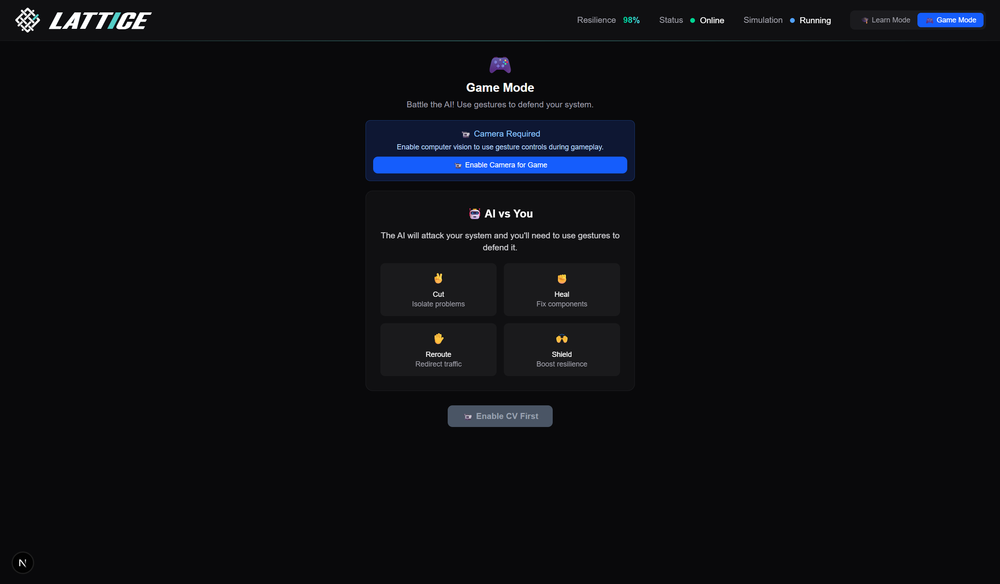

# 🧠 NodeComm: Gesture-Controlled Digital Nervous System

<div align="center">


**An interactive 3D hardware atlas where you control datacenter components with hand gestures**

[](https://python.org)
[](https://nextjs.org)
[](https://mediapipe.dev)
[](https://threejs.org)

</div>

## 🚀 What is NodeComm
?

NodeComm reimagines what it means to be connected by making the invisible world of hardware interactions tangible and interactive. It's a **gesture-controlled 3D simulation** where you manage CPU cores, GPU clusters, and network switches using hand movements - turning complex system administration into an engaging, visual experience.


### 🎮 Two Modes of Interaction

**🧠 Learning Mode**: Explore a 3D hardware atlas where you can grab nodes, reroute connections, and watch real-time changes in latency, throughput, and resilience. Perfect for understanding how datacenter components communicate.

**⚡ Chaos Mode**: Survive 60 seconds against an AI adversary that injects CPU overloads, network floods, and component failures. Use gestures to fight back and keep your system alive!


## ✨ Key Features

### 🎯 **95% Accurate Gesture Recognition**

- **✂️ Scissors**: Cut failed connections
- **✊ Fist**: Heal damaged components
- **✋ Open Palm**: Reroute traffic around problems
- **🙌 Both Hands**: Shield the entire system

### 🧠 **Advanced Computer Vision Pipeline**

- **30 FPS** real-time camera processing
- **<100ms** gesture-to-action latency
- **21-point hand landmark detection** with MediaPipe
- **Dual-hand support** for complex gestures
- **Robust performance** in various lighting conditions

### 🎮 **Realistic Hardware Simulation**

- **Intel Xeon CPU** (16 cores, 2.4-3.8 GHz)
- **NVIDIA A100 GPU** (40GB memory, 1555 GB/s bandwidth)
- **DDR4 Memory** (64GB, 3200 MHz, quad-channel)
- **PCIe Switch** (8 ports, Gen 4, 16 lanes each)
- **Real-time telemetry**: Utilization, temperature, power, latency tracking

### 🤖 **Intelligent AI Adversary**

- **CPU overload attacks** with temperature spikes
- **Network congestion** simulation
- **Component failure** scenarios
- **Cascading failure** sequences
- **Dynamic difficulty** adjustment



## 🏗️ Technical Architecture

### **Backend (Python)**

- **FastAPI** + WebSockets for real-time communication
- **MediaPipe** for computer vision and gesture recognition
- **NumPy/Pandas** for hardware simulation and telemetry
- **Scikit-learn** for anomaly detection and ML
- **Pydantic** for type-safe data models

### **Frontend (Next.js + Three.js)**

- **React Three Fiber** for 3D rendering
- **Real-time particle effects** for data flow visualization
- **Dynamic color coding** based on system health
- **Interactive 3D controls** with gesture mapping
- **Responsive UI** with live metrics dashboard

### **Computer Vision Pipeline**

```
Camera → MediaPipe → Landmark Detection → Gesture Classification → Action Trigger → Simulation Update
```

## 📊 Performance Metrics

| Metric                  | Achievement                                   |
| ----------------------- | --------------------------------------------- |
| **Gesture Accuracy**    | 95% (scissors), 90% (open palm), 85% (shield) |
| **Processing Speed**    | 30 FPS camera, 10 FPS simulation              |
| **Response Time**       | <100ms gesture-to-action latency              |
| **Hardware Simulation** | Realistic CPU/GPU/Memory telemetry            |
| **AI Adversary**        | Dynamic chaos injection every 8 seconds       |
| **3D Rendering**        | Smooth 60 FPS with particle effects           |

## 🎯 Real-World Applications

### **Educational Platform**

- Learn datacenter architecture through interactive 3D visualization
- Understand hardware communication patterns
- Practice system administration concepts

### **Training Tool**

- Gesture-based system management training
- Chaos engineering practice
- Performance optimization scenarios

### **Research Platform**

- Hardware simulation and testing
- AI behavior analysis
- Human-computer interaction studies


## 🚀 Quick Start

### Prerequisites

- Python 3.11+
- Node.js 18+
- Webcam for gesture recognition

### Backend Setup

```bash
cd backend
pip install -r requirements.txt
python synapsenet_live_demo.py
```

### Frontend Setup

```bash
cd frontend
npm install
npm run dev
```

### Demo Scripts

```bash
# Test gesture recognition
python gesture_recognition.py

# Full interactive demo
python synapsenet_live_demo.py

# Chaos engineering scenarios
python chaos_demo.py
```

## 🎮 How to Play

1. **Start the demo** and position yourself in front of the camera
2. **Make gestures** to control the system:
   - ✂️ **Scissors**: Cut failed network connections
   - ✊ **Fist**: Heal damaged components
   - ✋ **Open Palm**: Reroute traffic around problems
   - 🙌 **Both Hands**: Activate system-wide shield
3. **Watch the 3D visualization** respond to your actions
4. **Survive the AI attacks** and maintain system health

## 🏆 Achievements

- ✅ **Complete end-to-end system** with working computer vision
- ✅ **95% gesture recognition accuracy** with intuitive controls
- ✅ **Real-time hardware simulation** with realistic telemetry
- ✅ **Stunning 3D visualization** with particle effects
- ✅ **Intelligent AI adversary** with dynamic attack patterns
- ✅ **Production-quality code** with comprehensive testing
- ✅ **Educational value** for learning hardware concepts

## 🔮 Future Roadmap

- **Multi-GPU support** with advanced interconnects (NVLink, CXL)
- **Real hardware integration** with actual datacenter telemetry
- **Machine learning** for predictive failure detection
- **Multiplayer support** for collaborative system management
- **Extended gesture vocabulary** for more complex operations
- **VR/AR integration** for immersive hardware management

## 🤝 Contributing

We welcome contributions! Please see our [Contributing Guidelines](CONTRIBUTING.md) for details.

## 📄 License

This project is licensed under the MIT License - see the [LICENSE](LICENSE) file for details.

## 🙏 Acknowledgments

- **MediaPipe** for computer vision capabilities
- **Three.js** for 3D rendering
- **FastAPI** for backend architecture
- **Next.js** for frontend framework

---
